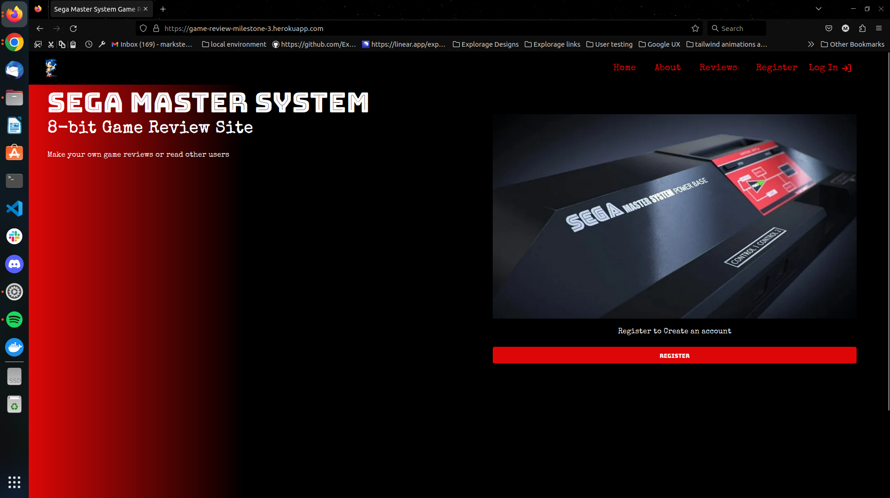
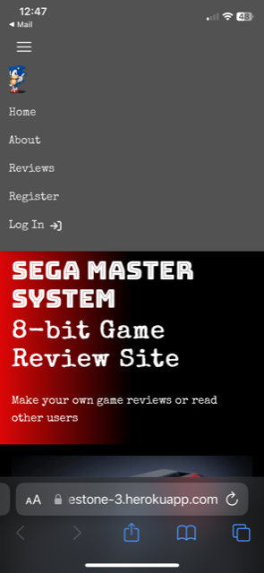
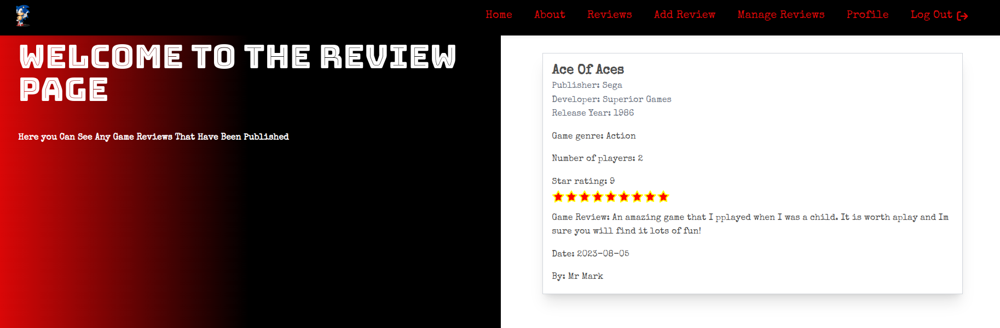

# Testing

Return back to the [README.md](README.md) file.

### HTML

I have used the recommended [HTML W3C Validator](https://validator.w3.org) to validate all of my HTML files.
I have ignored the warnings for trailing slashes.

| Page | W3C URL | Screenshot | Notes |
| --- | --- | --- | --- |
| Home |   | pass |
| About |  | pass |
| Reviews |  | pass |
| Register |   | pass |
| Login |  | pass |
| Add Review |  | pass |
| Manage Review |   | pass |
| Edit Review |  |  The value of the for attribute of the label element must be the ID of a non-hidden form control. Duplicate ID star_rating as the star rating is iterated over and therefore shows an error |
| Profile |  | Pass |

### CSS

I have used the recommended [CSS Jigsaw Validator](https://jigsaw.w3.org/css-validator) to validate all of my CSS files.

| File | Screenshot | Notes |
| --- | --- | --- |
| style.css |  | Pass: No Errors |

### JavaScript

I have used the recommended [JShint Validator](https://jshint.com) to validate all of my JS files.

| File | Screenshot | Notes |
| --- | --- | --- |
| script.js |  | One unused variable from external file |

### Python

I have used the recommended [PEP8 CI Python Linter](https://pep8ci.herokuapp.com) to validate all of my Python files.

## Browser Compatibility

I have tested my deployed project on multiple browsers to check for compatibility issues. As a developer I am using Linux Ubuntu so I am not able to test Microsoft Edge or Safari browsers on my machine.

| Browser | Screenshot | Notes |
| --- | --- | --- |
| Chrome |  | Works as expected |
| Firefox |  | Works as expected |
| Brave |  | Works as expected |
| Opera |  | Works as expected |

## Responsiveness

I have tested my deployed project on multiple devices to check for responsiveness issues. I have tested all pages and they work as expected. Below are screenshots of the homepage on various devices.

| Device | Screenshot | Notes |
| --- | --- | --- |
| Mobile (DevTools) |  | Works as expected |
| Tablet (DevTools) |  | Works as expected |
| Desktop |  | Works as expected |
| XL Monitor |  | Works as expected |
| Doogee N40 Pro |  | Navbar becomes gray |
| iPhone X |  | Navbar becomes gray |

## Lighthouse Audit

I've tested my deployed project using the Lighthouse Audit tool to check for any major issues. I would have tested the herouku live app but I ran into this error so I tested on my local app.

| Page | Size | Screenshot | Notes |
| --- | --- | --- | --- |
| Home | Mobile |  | warning on explicit image sizes |
| Home | Desktop |  | minor warnings |
| About | Mobile |  | warning on explicit image sizes |
| About | Desktop |  | minor warnings |
| Reviews | Mobile |  | tailwind css |
| Reviews | Desktop |  | minor warnings |
| Register | Mobile |  | warning on explicit image sizes |
| Register | Desktop |  | minor warnings |
| Log in | Mobile |  | reduce unused javascript |
| Log in | Desktop |  | minor warnings |
| Profile | Mobile |  | reduce unused javascript |
| Profile | Desktop |  | minor warnings |
| Manage reviews | Mobile |  | reduce unused javascript |
| Manage reviews | Desktop |  | minor warnings |
| Add Review | Mobile |  | aria id's button contrast, unused javascript |
| Add Review | Desktop |  | minor warnings, aria id's button contrast |
| Edit review | Mobile |  | warning on explicit image sizes layput shift and aria labels |
| Edit review | Desktop |  | warning on explicit image sizes layput shift and aria labels |

## Defensive Programming

- User-A is not able to manipulate data belonging to User-B, or vice versa
- Users cannot perform CRUD functionality while logged-out
- Users cannot brute-force a URL to navigate to a restricted page

Defensive programming was manually tested with the below user acceptance testing:

| Page | User Action | Expected Result | Pass/Fail | Comments |
| --- | --- | --- | --- | --- |
| Home Page | | | | |
| | Click on Home link in navbar | Redirection to Home page | Pass | |
| | Click on Register link on page | Redirection to register page | Pass | |
| About Page | | | | |
| | Click on About link in navbar | Redirection to About page | Pass | |
| Reviews Page | | | | |
| | Click on Reviews link in navbar | Redirection to Reviews page | Pass | |
| | If no reviews show default image and button |  | Pass | |
| | Reviews from different users are shown when added | Pass | |
| Register Page | | | | |
| | Click on Register link in navbar | Redirection to Register page | Pass | |
| | Click on Log in link under form | Redirection to Log in page | Pass | |
| | Enter username | Field will only accept text within parameters and show tooltip | Pass | |
| | Enter password  | Field will only accept text within parameters and show tooltip | Pass | |
| | Submitting existing username | flash message shows | Pass | |
| | Correctly filling inputs and clicking register | Redirects to profile page | Pass | |
| Log Out | | | | |
| | Click Logout button | Redirects user to log in page | Pass | |
| Log In | | | | |
| | Click on the Login nav link | Redirection to Login page | Pass | |
| | Enter username | Field will only accept text within parameters and show tooltip | Pass | |
| | Enter password  | Field will only accept text within parameters and show tooltip | Pass | |
| | Correctly filling out form and clicking login | Redirects user to profile page | Pass | |
| | Click on Register link under form | Redirection to register page | Pass | |
| Profile | | | | |
| | Click on the profile nav link | Redirection to profile page | Pass | |
| | Click on the create new review button | User will be redirected to the add review page | Pass | |
| | Click on the manage reviews button | User will be redirected to the add review page | Pass | |
| | Only show change author if reviews >0 |  | Pass | |
| | Show number of review/s made and name of game/s | | Pass | |
| | Show flash message author name has been updated | | Pass | |
| | Updates all users (only) author names on review cards | | Pass | |
| | Author name | User must imput 3-30 characters if imncorrect show tooltip | Pass | |
| Add Review| | | | |
| | Click on add review in the nav link | Redirection to add review page | Pass | |
| | Click on the submit button | User cant proceed | Pass | |
| | Click on the submit button with a game name already in users reviews | User will be shown a message you have already made a review for this game | Pass | |
| | Click in the manage reviews button | user is redirected to manage reviews | Pass | |
| | All imputs show tooltips with parameters on ivalid user input() | Tooltip is shown | 2 Fail | See Bugs Section |
| | Click submit with no game name selected | user is redirected to manage reviews | Fail | See Bugs Section |
| | Click submit with no game genre selected | user is redirected to manage reviews | Fail | See Bugs Section |
| | Clicking on game name shows dropdown list | user can search or select a game which then shows in the input field| Pass | |
| | Clicking on game genre shows dropdown list | user can search or select a game genre which then shows in the input field| Pass | |
| | Using a different author name if reviews >0 updates all users review cards | | Pass | |
| | Using a different author name if reviews >0 updates all users review cards | | Pass | |
| | Flash message when game review has been added |  | Pass | Considered redirect to manage reviews page, but thought user may wish to add another review  |
Manage Reviews | | | | |
| | Click on the manage reviews nav link | Redirection to manage reviews page | Pass | |
| | Click on the create edit review button | User will be redirected to the add edit review page | Pass | |
| | Click on the delete review button | Shows warning popup | Pass | |
| | Warning popup | user can delete the review or cancel | Pass | reviews are deleted if user preses ok and is removed from reviews page and manage rviews page|
| | Users reviews appear on page | | Pass | |
| | Default image and button appear if no reviews have been made | | Pass | |
Edit Reviews | | | | |
| | The specified review to edit appears | All details from the review appear on the form | 1 fail see bugs | |
| | Game name is not editable |  | Pass | |
| | All except game name fields are editable |  | Pass | |
| | All tooltips with set parameters show for all imput fields |  | Pass | |
| | Update review button | the form updates with the new user inputs on both manage reviews and reviews page| Pass | |

## User Story Testing

| User Story | Screenshot |
| --- | --- |
| As a new site user, I would like to be able to register for an account with a username and password. |  |
| As a new site user, I would like to be able to log in with my username and password, so that I can access my account |  |
| As a new site user, I would like to be able to log out of my account. |  |
| As a new site user, I would like to be able to see my profile page, so that I can quickly see the reviews I have made. |  |
| As a new site user, I would like to be able to make a review/s of master system games. |  |
| As a new site user, I would like to be able to see my game review/s, so that I can edit them. |   |
| As a new site user, I would like to be able to see my game reviews/s, so that I can delete them. |  |
| As a new site user, I would like to be able to change my author name, so that it appears on all of my reviews. |  |
| As a returning site user, I would like to be able to login back to my account. |  |
| As a returning site user, I would like to be able to see the reviews that I made the last time a was on the site. |  |

## Bugs

- Key error - To fix this I added the user id to the database and put the user id into session.

    

    

## Unfixed Bugs

- 'Required' not working on form for game name and game genre.

    - When applying required to the code for the forms in game name and game genre, the required text box did not appear and the user could still submit the form. I believe that this is because the imputs are using classes from tailwind elements and are somehow blocking this functionality. This would need further investigation.

- If you have your user name and password stored in your cache the tailwind elements form inputs helper text sits over the input cached text. This I believe is a design flaw in tailwind elements.

    

- I have a console warning regards the use of using the tailwind cdn in production. I would have to install the tailwind CLI to fix this which I will leave for when I come back to this project to develop it further.

    

- The star rating and game genre do not carry accross to the form from the users review when on the edit review page. I believe the genre is not due to the tailwind elements classes effecting the form however I believe that more code could be required to get the star rating from the previous form.

